<div align="center">


# CharacterArc · 弧光

### 🔱 深度魔改增强版 · AI 小说创作桌面应用

<p>
  <strong>基于原版项目 <a href="https://github.com/uu201/character-arc">uu201/character-arc</a> 深度魔改扩展</strong><br />
  面向需要长期维护项目设定、角色关系、剧情结构与章节正文的创作者
</p>

<p>
  <a href="#-项目声明">💠 声明</a> ·
  <a href="#-开发统计">📊 开发统计</a> ·
  <a href="#-功能概览">功能概览</a> ·
  <a href="#-截图">截图</a> ·
  <a href="#-快速开始">快速开始</a> ·
  <a href="#-技术栈">技术栈</a>
</p>

<p>
  
  
  
  
  
  
  
</p>

</div>

---

## 💠 原版项目声明

> **欢迎支持上游原版项目：[uu201/character-arc](https://github.com/uu201/character-arc)** 🙏
>
> 本项目（弧光·深度魔改增强版）**基于原版 character-arc 深度魔改扩展的开源小说编辑器**。
>
> 在原项目基础上：
> - ✅ **完善底层逻辑**：修复原版多处已知问题，优化 SQLite 持久化、AI 管线调度、防抖写回、状态同步等核心机制
> - ✨ **新增大量功能**：全局智能体、插件系统、回收站、番茄风向标一键生成新书、模型性能基准测试、提示词库页面、工作台菜单顺序、多主题切换、MCP 协议接入、语音输入、图片识别配置、从CC Switch导入AI接口配置、从CC switch导入Skills、快速滑动按钮、回退悬浮按钮、智能体对话框/唤起快捷指令、AI后台任务等
> - 🔧 **底层架构升级**：Assistant Runtime 、暂存变更审阅、Agent Memory、权限系统、证据账本、执行规划、对话管理等深度重构
> - 🎨 **UI/UX 全面提升**：十二套界面主题、颜色深浅自定义、标题栏AI后台任务、批量选择/删除、全局命令面板等
>
> 累计投入：**共提交 944 次代码，处理 258 个 Issue**，在保持原版项目核心理念的同时，打造更完善、更专业的 AI 小说创作工作台。

---

## 📊 开发统计

<table>
  <tr>
    <td width="50%" align="center" valign="top">
      <a href="docs/assets/github_stats.png">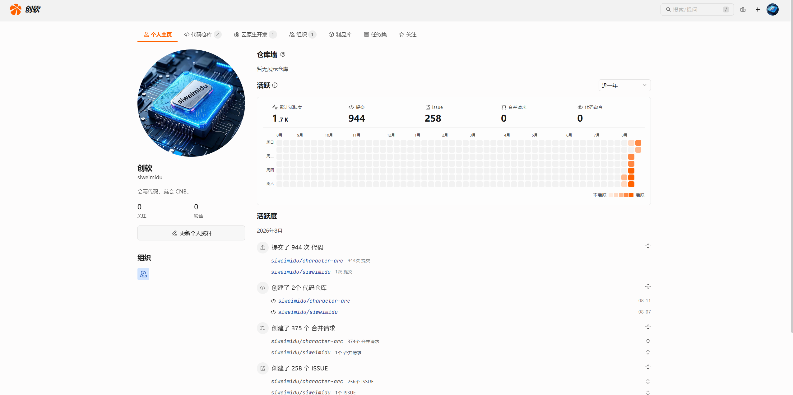</a>
    </td>
    <td width="50%" valign="top">
      <h3>代码提交与 Issue 处理</h3>
      <ul>
        <li><strong>代码提交：944 次</strong> — 覆盖主进程、渲染层、AI 管线、Skill 系统、UI 组件等全链路</li>
        <li><strong>Issue 处理：258 个</strong> — 包含 Bug 修复、功能需求、性能优化、体验改进</li>
        <li><strong>合并请求：375 个</strong> — 以 PR 驱动的迭代流程，保证每一项改动可追溯、可回滚</li>
      </ul>
      <p>
        <sub>提交中包含原创内容与基于原版框架的深度重构。感谢原作者 zhouyeshan 提供的优秀底座。</sub>
      </p>
    </td>
  </tr>
</table>

---

## ✨ 项目简介

CharacterArc（弧光）不是"只会对话的 AI 壳子"，而是一套围绕小说项目组织、章节写作与 AI 协作搭起来的桌面工作台。本增强版在原版基础上对底层逻辑与功能广度做了全面升级。

<table>
  <tr>
    <td width="50%" valign="top">
      <h4>🏠 本地优先</h4>
      <p>项目数据保存在本机 SQLite，无需依赖在线服务，写作内容完全自己掌控。</p>
    </td>
    <td width="50%" valign="top">
      <h4>📦 项目隔离</h4>
      <p>每个项目独立维护设定、章节、知识库与 AI 运行记录，互不干扰。</p>
    </td>
  </tr>
  <tr>
    <td width="50%" valign="top">
      <h4>📖 章节导向</h4>
      <p>大纲、灵感、知识和 AI 能力最终都围绕章节创作落地。</p>
    </td>
    <td width="50%" valign="top">
      <h4>🧩 Skill 驱动</h4>
      <p>AI 调用可按任务自动匹配内置 / 项目级 Skill 包，并支持 Agent Loop 调度。</p>
    </td>
  </tr>
  <tr>
    <td width="50%" valign="top">
      <h4>🌐 多厂商接入（增强）</h4>
      <p>支持 30+ 模型厂商一键配置（Gemini、OmniRoute、FreeAPI、Agnes、DeepSeek、通义、智谱、Kimi、硅基流动、Ollama、Cloudflare、Cohere 等），含接口连通性测试与<strong>模型性能基准</strong>。</p>
    </td>
    <td width="50%" valign="top">
      <h4>🤖 全局智能体 （新增）</h4>
      <p>跨项目资料检索、设定修改、技能模块插件化（MCP / Plugin / Script 运行时），能力与市场双栏管理。</p>
    </td>
  </tr>
  <tr>
    <td width="50%" valign="top">
      <h4>🎨 多主题系统（新增）</h4>
      <p>十二套界面主题（海蓝/玉绿/琥珀/玫红/苹果/谷歌/极简/Claude/豆包/Trace代码/办公/纸质等），支持颜色深浅滑块与深/浅色模式即时切换。</p>
    </td>
    <td width="50%" valign="top">
      <h4>🗑️ 回收站机制（新增）</h4>
      <p>项目、章节、世界观、角色、组织、关系、大纲、灵感、知识文档、Skill、AI 运行日志等全局回收，支持保留天数设定，误删可一键恢复。</p>
    </td>
  </tr>
  <tr>
    <td colspan="2" valign="top">
      <h4>🍅 番茄风向标（新增）</h4>
      <p>番茄小说榜单实时趋势，按女频新书榜/男频新书榜/女频阅读榜/男频阅读榜、近 7/14/30 日分类查看热门综合赛道（都市、玄幻、历史、游戏、悬疑等），新增 AI 一键生成新书选题。</p>
    </td>
  </tr>
</table>

---

## 🚀 功能概览

<details open>
<summary><b>📂 项目与资料（增强）</b></summary>

- **项目中心**：创建、查看、编辑、删除、批量生成小说项目，支持排序方式 / 批量生成 / 批量管理三档切换
- **新建项目向导**：填写题材、篇幅、简介，可调用 AI 螺旋式生成首批设定与大纲（骨架 → 展开 → 校验）
- **创作记忆面板**：按分卷维护计划、进度、伏笔和素材，支持参考作品拆解
- **知识中心**：沉淀项目事实、创作记忆、参考资料与风格分析结果
- **拆书知识库**：全局共享，与项目解耦，支持导入作品 → AI 深度拆书 → 风格指纹提取 → 一键生成新书选题
- **技能系统**：支持启用内置 Skill，也支持为单项目导入额外 Skill 包
- **📒 续写导入**（新增）：分块导入已有长篇文本，自动建立章节绑定与故事状态回填
- **📚 项目知识库**（增强）：文档范围可按「全局 / 分卷 / 章节」精细限定

</details>

<details open>
<summary><b>🌍 世界观与结构</b></summary>

- **世界观 / 角色 / 组织 / 关系管理**：维护小说基础设定资产；世界观批量生成会将英文分类统一归一为中文分类
- **关系图谱**：可视化角色关系与组织关联（Cytoscape），支持组织成员身份链路
- **剧情大纲**：双栏交错时间线布局，按分卷组织剧情节点，支持拖拽排序、折叠状态记忆与 AI 扩写
- **剧情线索**：辅助维护伏笔、悬念与回收计划，支持批量生成与伏笔自动检测
- **小说工作流文档**（增强）：Workflow Documents 支持分阶段沉淀设定变更

</details>

<details open>
<summary><b>✍️ 章节创作（增强）</b></summary>

- **VS Code 风格三栏工作区**：目录树 + TipTap 正文编辑器 + AI 侧边栏（含对话/暂存/历史三页）
- **按大纲新建章节**：新建章节时先选择大纲节点，自动带入标题、摘要、字数目标并建立绑定
- **富文本编辑**：基于 TipTap，支持搜索替换、格式化、选区动作、行内差异比对、命令面板（Ctrl+Shift+P）
- **自动保存与历史版本**：编辑后自动落盘，支持手动快照与版本回滚，单章节历史版本独立管理
- **阅读模式 / 专注模式**：以更接近成稿阅读的方式检查节奏
- **字数目标**：按章节设置目标字数并跟踪完成度，可一键按目标字数调整当前章节
- **导出**：章节正文可导出为 `.txt` / `.docx`，工作区可导出 JSON 快照
- **生成初稿流程**（增强）：目标字数 → 全局补充指令 → 上下文预览（世界观/角色/组织/关系/伏笔）→ 开始流式生成，生成后自动写后审计与状态 Delta 提取
- **章节版本还原**（增强）：历史版本独立页面，支持单版本一键恢复

</details>

<details open>
<summary><b>🤖 AI 辅助（深度增强）</b></summary>

- 章节润色、续写、改写、节奏调整、摘要、伏笔识别、后续剧情链
- 章节初稿整章单次流式生成，引入写前备忘与写后审计
- AI 对话流式输出，生成中支持中途停止
- **推理内容隔离**：兼容 MiniMax、DeepSeek、通义、Kimi、GLM、Gemini 等模型的 reasoning 字段，并避免思考标记写入正文
- **接口错误详情**：优先展示中转站返回的 `error` / `message` / `responseBody` 和 HTTP 状态码
- **Agent Loop 模式**：模型按 Skill 索引与工具注册表循环思考，可直接调用工具编辑章节； 新增 Progressive Skill Disclosure 与上限 8 步的思考循环
- **任务进度面板**：标题栏统一查看正在运行与历史 AI 任务，失败可一键重试
- **Assistant Runtime v2**（新增）：证据账本、暂存变更审阅、Agent 记忆存储、权限控制、执行规划、对话管理、上下文路由
- **Agent 模块系统**（新增）：MCP Server 接入（内置 SQLite 存储、文件系统、小说专用服务）、Plugin 运行时、自定义 JS 脚本执行
- **提示词库**（新增）：全局 Prompt 模板管理，写作场景下一键复用
- **故事状态机**（增强）：章节生成后异步抽取 StateDelta → 轻量冲突校验 → 向量索引建立 → 失败仅警告不阻塞
- **AI 运行日志**（新增）：每次模型调用独立记录（参数/模型/耗时/Token 用量），可回收/重放

</details>

<details open>
<summary><b>⚙️ 设置与连接（大幅增强）</b></summary>

- **45家厂商一键预设**：Gemini、OmniRoute、FreeAI、Agnes、aion、cerebras、cloudflare、cohere、阶跃星辰、AutoMinimax、HubWay、AgentRouter、huggingface、mistral、nvidia、ollama、openrouter、pollinations、routeway、siliconflow 等
- **模型性能基准测试**（新增）：一键测试延迟（ms）、吞吐（tokens/s）、本次 Token 消耗
- **多配置管理**：支持多套接口配置命名保存，标题栏一键切换；导入整套FreeLLMAPI密钥配置 JSON，CC switch AI接口配置导入
- **网络代理**：全局 HTTP/HTTPS/SOCKS 代理配置
- **图片生成配置**：独立配置图像模型、Key、Base URL
- **图片识别 / 多模态配置**：独立 Vision 模型配置，支持图文理解场景
- **语音识别配置**（新增）：TTS/STT 模型厂商预设
- **界面主题**（新增）：12 套预设主题 + 颜色深浅滑块 + 深/浅色模式切换
- **应用偏好**：自动保存时间间隔（1~30 分钟）、界面缩放比例

</details>

<details open>
<summary><b>🎨 封面工作台</b></summary>

- 面向平台（番茄、起点、晋江、知乎盐言、七猫、刺猬猫等）生成封面 Prompt
- 调用图像模型生成预览图，可在工作台中对比历史版本

</details>

<details open>
<summary><b>🍅 番茄风向标（新增）</b></summary>

- 对接番茄小说榜单公开数据（近 7/14/30 日、全部样本）
- 四榜切换：女频新书榜 / 男频新书榜 / 女频阅读榜 / 男频阅读榜
- 热门综合赛道（都市现实、玄幻仙侠、历史军事、游戏衍生、悬疑灵异…）：在读增长、+/- 新书数、+/- 掉榜数、出版社数、热门标签一键查看
- **AI 风向速评**：一句话总结近 7 日赛道增长趋势与新书题材偏好
- **一键 AI 生成新书选题**：基于当前热门赛道，螺旋生成题材/人设/大纲
- 导出当前数据 / 刷新 / 导出拆书知识库

</details>

<details open>
<summary><b>🗑️ 回收站（新增）</b></summary>

- 全局回收项 16+ 类：AI 接口配置、图片/语音/视觉配置、参考作品、项目、Skill、章节历史版本、角色卡、世界观条目、组织、关系、灵感、提示词库、剧情大纲节点、伏笔、AI 调用日志、智能体对话、项目知识库
- 批量恢复 / 批量彻底删除
- 保留天数（默认 5 天）自由调整，到期自动永久删除

</details>

---

## 📸 截图

<table>
  <tr>
    <td width="50%" align="center">
      <a href="docs/assets/homepage.png">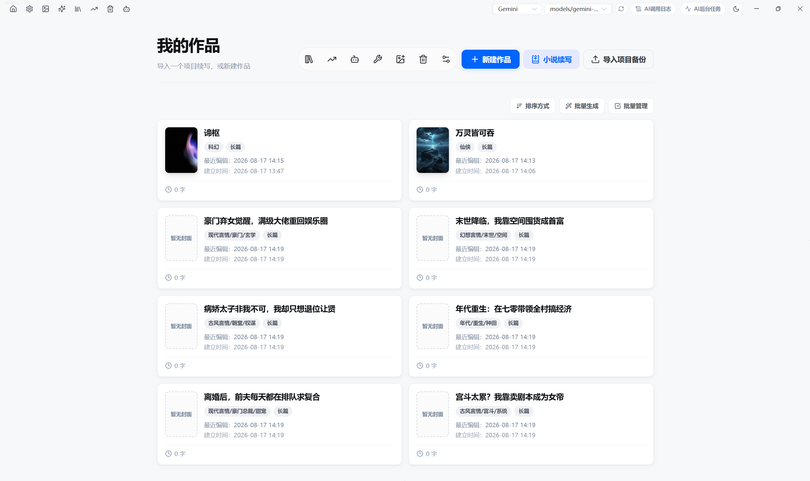</a>
      <br /><sub><b>项目中心</b> · 集中管理所有小说项目，支持批量生成与批量管理</sub>
    </td>
    <td width="50%" align="center">
      <a href="docs/assets/overview.png">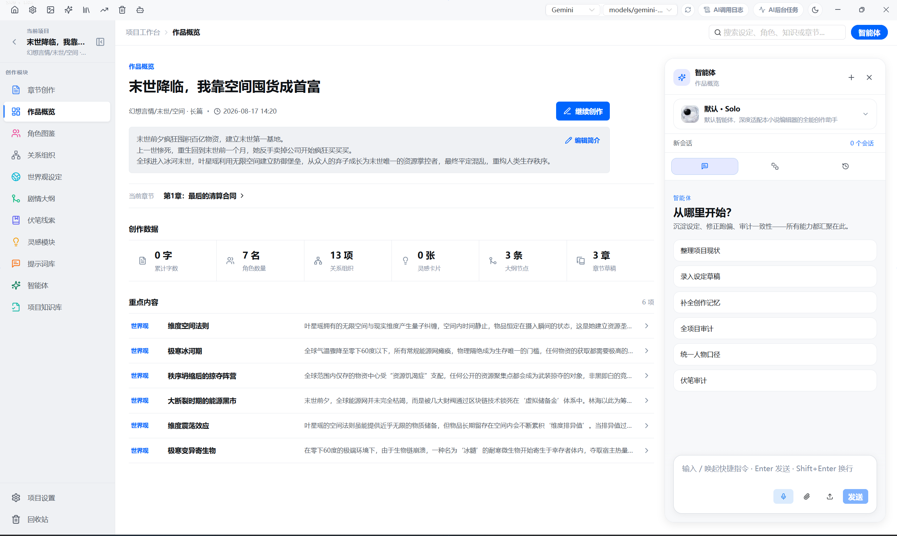</a>
      <br /><sub><b>作品概览</b> · 基础信息、设定资产、章节进度 + 全局智能体侧栏</sub>
    </td>
  </tr>
  <tr>
    <td width="50%" align="center">
      <a href="docs/assets/book_disassembly.png">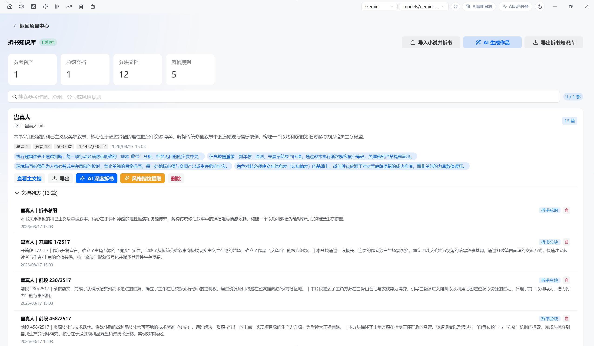</a>
      <br /><sub><b>拆书知识库</b> · 导入作品 → 总纲/分块/风格规则分层沉淀 → 一键生成新书</sub>
    </td>
    <td width="50%" align="center">
      <a href="docs/assets/chapter_creation.png">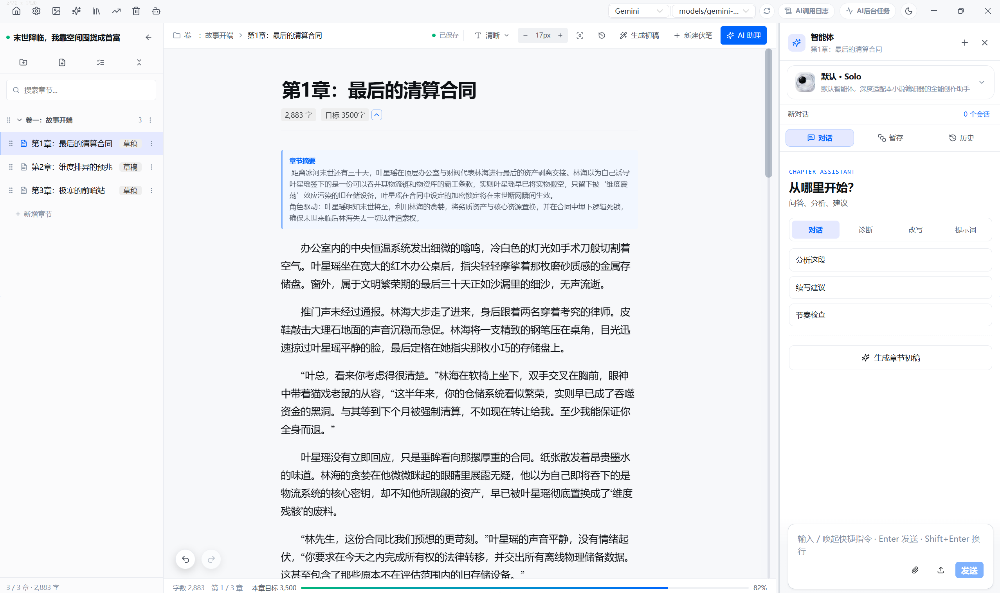</a>
      <br /><sub><b>章节创作</b> · 目录树 + TipTap 编辑器 + AI 侧边栏（对话/暂存/历史）</sub>
    </td>
  </tr>
  <tr>
    <td width="50%" align="center">
      <a href="docs/assets/chapter_first_draft.png">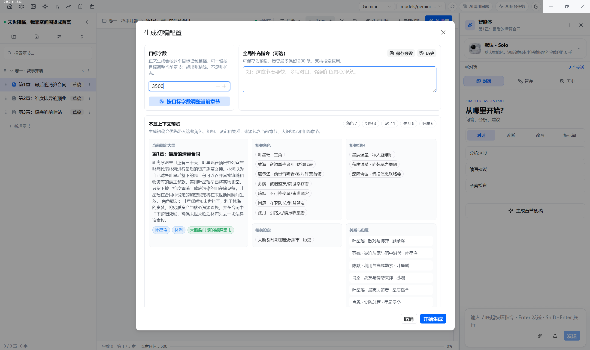</a>
      <br /><sub><b>生成初稿配置</b> · 目标字数 + 全局补充指令 + 完整上下文预览</sub>
    </td>
    <td width="50%" align="center">
      <a href="docs/assets/global_agent.png">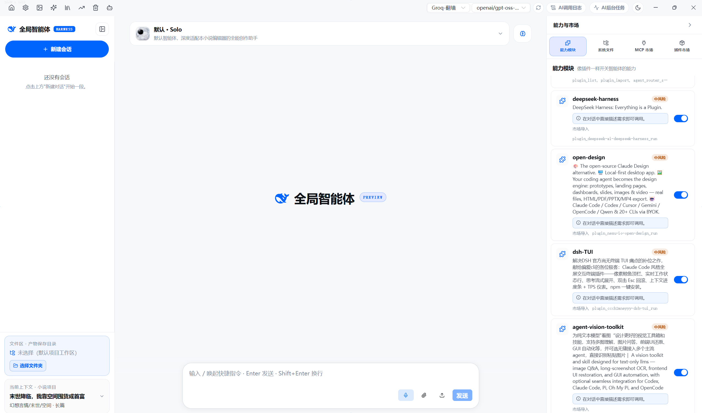</a>
      <br /><sub><b>全局智能体 v2</b> · 插件市场、能力模块、MCP/Plugin/Script 运行时</sub>
    </td>
  </tr>
  <tr>
    <td width="50%" align="center">
      <a href="docs/assets/ai_config.png">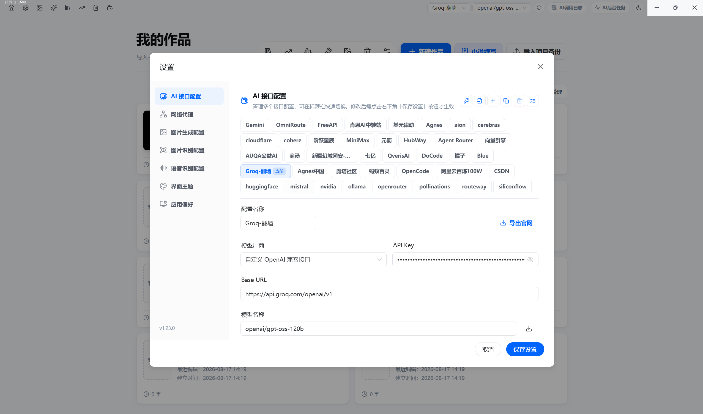</a>
      <br /><sub><b>AI 接口配置</b> · 30+ 厂商一键预设、多套配置管理、一键导出官网</sub>
    </td>
    <td width="50%" align="center">
      <a href="docs/assets/model_benchmark.png">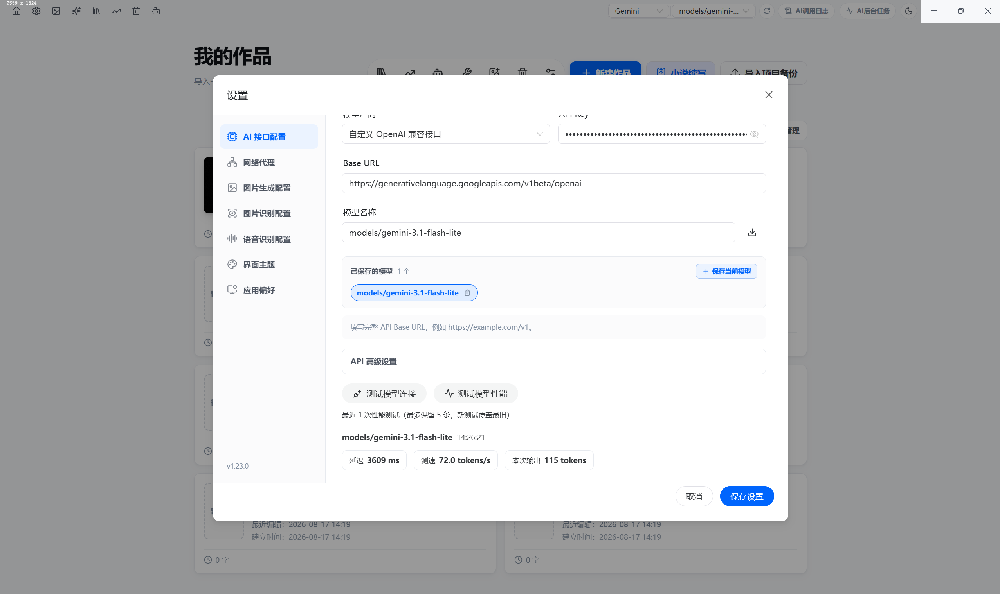</a>
      <br /><sub><b>模型性能基准</b> · 延迟/吞吐/Token 用量一键测速，历史记录留存</sub>
    </td>
  </tr>
  <tr>
    <td width="50%" align="center">
      <a href="docs/assets/theme_settings.png">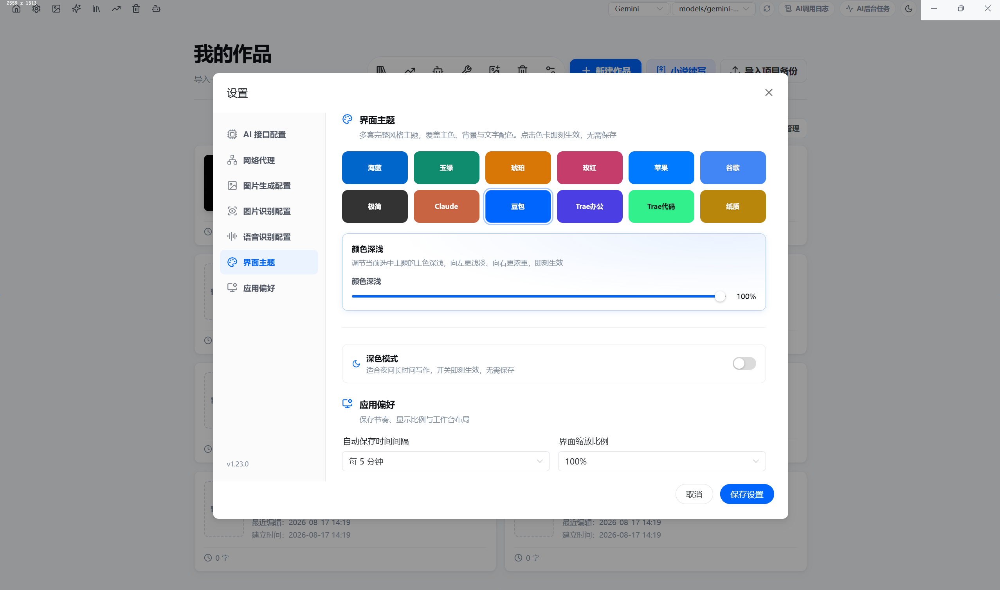</a>
      <br /><sub><b>界面主题</b> · 12 套主题 + 颜色深浅滑块 + 深/浅色模式即时生效</sub>
    </td>
    <td width="50%" align="center">
      <a href="docs/assets/fanqie_trends.png">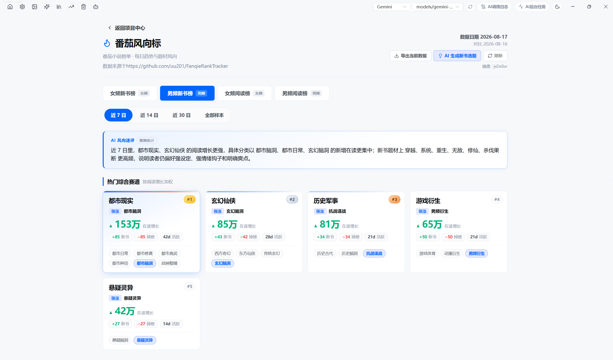</a>
      <br /><sub><b>番茄风向标</b> · 四榜切换、热门赛道、AI 风向速评、一键生成新书</sub>
    </td>
  </tr>
  <tr>
    <td colspan="2" align="center">
      <a href="docs/assets/recycle_bin.png">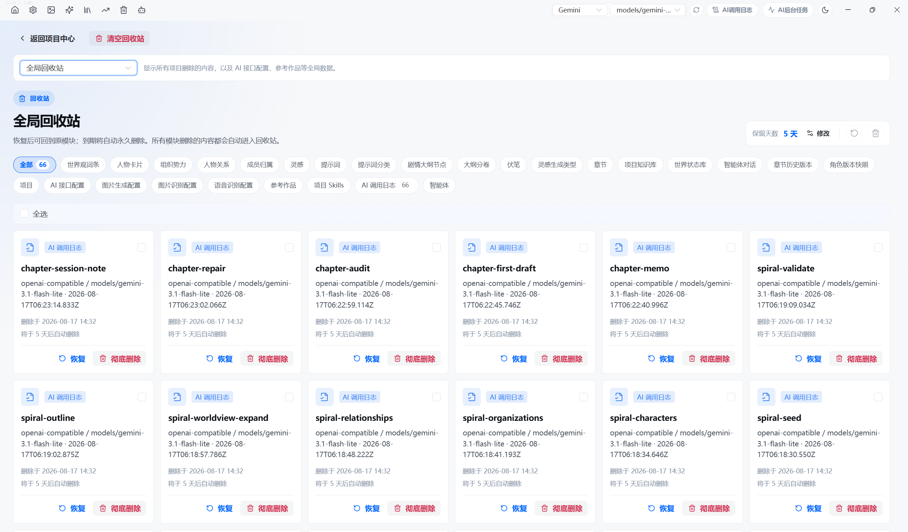</a>
      <br /><sub><b>全局回收站</b> · 16+ 类资源可回收，保留天数可调、批量恢复/删除</sub>
    </td>
  </tr>
</table>

---

## 🧱 技术栈

| 层 | 技术 |
|---|---|
| 框架 | Electron 37 + Vue 3.5 + TypeScript 5.9 |
| 状态管理 | Pinia |
| UI 组件库 | Naive UI（12 套自定义主题令牌覆盖） |
| 构建工具 | electron-vite (Vite 7) |
| 富文本编辑 | TipTap |
| 持久化 | SQLite（主进程 `node:sqlite` DatabaseSync） |
| 关系图谱 | Cytoscape |
| AI SDK | Vercel AI SDK (@ai-sdk/openai, @ai-sdk/anthropic) |
| Agent 运行时 | 自研 Assistant Runtime v2 + Agent Module / MCP / Plugin 三通道 |
| 向量检索 | 本地 Embedding + @node-rs/jieba 中文分词 |
| 文档解析 | mammoth (.docx)、marked (Markdown) |

---

## 📋 环境要求

- **Node.js** 18+
- **pnpm** 10+（pinned 10.33.2）
- **Windows**（本仓库默认 Windows 环境；macOS / Linux 需将 `package.json` 脚本中的 `set` 前缀改为 `cross-env`）

---

## ⚡ 快速开始

```bash
# 安装依赖（.npmrc 使用 npmmirror）
pnpm install

# 启动开发环境：同时启动 Electron 主进程 + Vite 渲染进程
pnpm run dev

# 类型检查 + 构建（vue-tsc --noEmit 是唯一的静态质量门）
pnpm run build

# 运行构建产物
pnpm run preview

# 打包 Windows NSIS 安装程序
pnpm run dist
```

---

### 🔑 首次配置 AI

启动应用后，打开右上角「设置」→ **AI 接口配置**：

1. 从 30+ 厂商预设中点选，或手动选择「自定义 OpenAI 兼容接口」/「自定义 Anthropic 接口」
2. 填入 Base URL、API Key、模型名称（可一键从接口拉取模型列表）
3. （可选）点击「测试模型连接」确认连通；再点击「测试模型性能」获取延迟/吞吐/Token 统计
4. 点击「保存当前模型」→「保存设置」，即可在标题栏模型切换器中秒切

封面工作台使用的图像模型、多模态识别、语音输入可在同页面其它标签中独立配置。

---

## 📁 项目结构

<details>
<summary>点击展开完整目录树</summary>

```
character-arc/
├── electron/
│   ├── main/
│   │   ├── ai/
│   │   │   ├── agent/              # Agent Loop v1：工具注册表、系统提示词、流式编排、技能加载
│   │   │   ├── agent-modules/      # Agent 模块系统：MCP Client、Plugin Runtime、Registry、SQLite Store
│   │   │   ├── audit/              # 轻量写后校验
│   │   │   ├── prompts/            # 通用提示词片段
│   │   │   ├── runtime/            # AI 任务调度 v1：上下文、执行计划、事件
│   │   │   ├── runtime-v2/         # Assistant Runtime ：证据账本、暂存变更、权限、规划、对话管理
│   │   │   ├── skills/             # Skill 发现、匹配、注册、清单
│   │   │   ├── spiral/             # 螺旋式项目生成管线
│   │   │   ├── tasks/              # 50+ AI 任务 handlers（章节/世界观/角色/大纲/线索/风格…）
│   │   │   └── transport/          # 模型传输层：HTTP、图像、语音、视觉、模型列表、Token 估算
│   │   ├── archive/                # 项目归档 / 导入
│   │   ├── index.ts                # 主进程入口
│   │   ├── register-main-ipc.ts    # 工作区/文件/导出/技能 IPC
│   │   ├── ai/ipc.ts               # AI 流式/生成/取消/探针/故事状态 IPC
│   │   ├── window-manager.ts       # 窗口管理、titleBarOverlay
│   │   ├── workspace-store.ts      # SQLite：建表、迁移、快照、防抖写回
│   │   ├── story-state-store.ts    # 故事状态：StateDelta、向量索引片段
│   │   ├── continuation-import.ts  # 续写导入分块
│   │   ├── fanqie-trends.ts        # 番茄风向标数据抓取与解析
│   │   ├── github-mirror.ts        # GitHub 镜像/测速
│   │   └── referenceAnalysis.ts    # 参考作品深度拆解
│   ├── preload/                    # window.characterArc 桥接层
│   └── shared/                     # 主进程/渲染层共享类型
├── renderer/
│   └── src/
│       ├── components/
│       │   ├── chapterWorkspace/   # 三栏章节创作工作区
│       │   ├── assistantV2/        # 全局智能体 ：会话、消息、插件市场、暂存变更、MCP 市场…
│       │   └── home/               # 首页/项目中心：卡片、批量、设置、教程、更新
│       ├── features/               # 功能模块（ai、chapters、cover、knowledge、relations、
│       │                             settings、wizard、workspace、writingStyles、announcements…）
│       ├── pages/                  # 页面级视图：项目中心/工作台/章节室/封面/拆书/向导/技能/
│       │                             续写导入/番茄风向标/全局智能体/回收站
│       ├── stores/                 # Pinia Store（app + globalAiGenerate）
│       ├── styles/                 # 全局样式
│       ├── theme/presets.ts        # 12 套主题预设令牌
│       ├── types/                  # 共享类型
│       └── utils/                  # 工具函数
├── resources/
│   ├── icon.ico / icon.png         # 应用图标
│   └── skills/                     # 内置 Skill（3 组，共 28 个）
├── build/                          # electron-builder：NSIS、afterPack
├── .github/workflows/release.yml   # macOS 自动打包
├── electron.vite.config.ts
├── package.json
└── tsconfig.json
```

</details>

---

## 🏛️ 架构概览

```
┌──────────────────────────────────────────────────────────────────┐
│                       Electron 主进程                              │
│  ┌──────────┐ ┌───────────┐ ┌────────────────────────────────┐   │
│  │ 窗口管理  │ │ SQLite    │ │      AI 管线（双层运行时）       │   │
│  │ titleBar │ │ 工作区库   │ │  ┌───────────┐  ┌────────────┐ │   │
│  │ Overlay  │ │ 故事状态库 │ │  │ Runtime   │  │ Assistant  │ │   │
│  └──────────┘ │ 向量索引   │ │  │ v1 调度器 │  │ Runtime v2 │ │   │
│               └───────────┘  │  └───────────┘  └────────────┘ │   │
│                              │  ┌─────────┐ ┌────────┐ ┌────┐ │   │
│                              │  │ Skills  │ │ Agent  │ │ MCP│ │   │
│                              │  │ 系统    │ │ Module │ │Plugin│   │
│                              │  └─────────┘ └────────┘ └────┘ │   │
│                              └────────────────────────────────┘   │
├──────────────────────────── IPC 桥接 ─────────────────────────────┤
│                        Vue 3 + Pinia 渲染层                        │
│  ┌──────────┐ ┌──────────┐ ┌────────────────────────────────┐    │
│  │ Pinia    │ │ TipTap   │ │   Naive UI × 12 主题预设        │    │
│  │ Store    │ │ 编辑器    │ │   （深浅色+颜色深浅滑块）       │    │
│  └──────────┘ └──────────┘ └────────────────────────────────┘    │
│  ┌──────────┐ ┌──────────┐ ┌────────────────────────────────┐    │
│  │ 章节创作 │ │ 全局智能体│ │ 番茄风向标 / 回收站 / 续写导入  │    │
│  │ 三栏工作区│ │  v2 面板  │ │  （魔改新增页面）              │    │
│  └──────────┘ └──────────┘ └────────────────────────────────┘    │
└──────────────────────────────────────────────────────────────────┘
```

> **数据流**：启动 → 主进程建窗 → 渲染层初始化 Pinia → 从 SQLite 加载工作区 → 用户编辑 → Pinia 更新 → 防抖写回 SQLite → AI 请求统一由主进程调用（流式事件通过 IPC 推回渲染层）

---

## 🧰 内置 Skill 包

应用当前在 `resources/skills/` 下内置 3 组、共 28 个 Skill。技能面板会按来源分组展示，开发版与打包版使用同一套目录结构。

| 来源 | 数量 | 代表 Skill | 说明 |
|---|---:|---|---|
| `oh-story-claudecode` | 12 | `story-long-write`、`story-short-write`、`story-chapter-exec` | 核心网文写作工作流，覆盖长篇、短篇、章节执行、拆文、扫榜、封面、去 AI 味、故事蓝图与番茄排版 |
| `community-skills` | 3 | `humanizer-zh`、`style-fingerprint`、`style-fusion` | 通用风格与润色能力，适合中文去 AI 味、风格提取和风格融合 |
| `Distilled-Novel-Toolbox` | 13 | `novel-anti-detection`、`novel-character-design`、`novel-commercialization` | 工程化网文知识库，覆盖题材、人设、世界观、节奏、情绪、爽点、润色、平台、合规与反检测 |

> `resources/skills/<来源>/<skill-id>/SKILL.md` 会被自动扫描为内置 Skill；还可以导入独立的 Skill 包，作用范围仅限该项目（项目级 Skill 可覆盖同名内置 Skill）。

---

## 💾 数据与隐私

应用数据完全保存在本地 Electron 用户目录下，**不上传任何第三方服务**：

- 📊 **数据库**：`<userData>/data/workspace.db`（SQLite，含项目、设定、章节、AI 记录、故事状态、回收项）
- 📦 **项目 Skill**：`<userData>/project-skills/<project-scope 或 _shared>`
- 🧠 **Agent 记忆**：`<userData>/data/` 下独立存储

> 安装程序本身也不会联网采集任何遥测数据；所有出站网络请求仅由用户显式配置的 AI / 图像 / 番茄风向标接口触发。

---

## 🙏 鸣谢

### 上游原版项目（特别感谢）

- 🎯 **[uu201/character-arc](https://github.com/uu201/character-arc)**（原作者 zhouyeshan）— 提供了本增强版赖以构建的完整底座、核心写作工作流与 Skill 方法论。**请支持原版，点个 Star ⭐！**

### 上游skills资源项目

- [oh-story-claudecode](https://github.com/worldwonderer/oh-story-claudecode) — 核心写作 Skills 的方法论与 prompt 工程基础
- [dama-cyber/Distilled-Novel-Toolbox](https://github.com/dama-cyber/Distilled-Novel-Toolbox) — 小说工作流与创作辅助方向的参考
- [JiuDolly/FanqieRankTracker](https://github.com/JiuDolly/FanqieRankTracker) — 番茄风向标数据源参考

---

## 📄 License

[MIT](./LICENSE) © 本增强版贡献者（基于 [uu201/character-arc](https://github.com/uu201/character-arc) 深度魔改扩展）

---

<div align="center">

<sub>如果这个深度魔改版本对你有帮助，欢迎 Star ⭐ 本仓库，同时也请给上游原版项目 <a href="https://github.com/uu201/character-arc">uu201/character-arc</a> 点个 Star ⭐ 支持原作者。</sub>

</div>
